# Customer Churn: A Narrative Project Report

**IBM Telco Customer Churn**  
**Companion to:** `notebooks/churn_analysis_refactored.ipynb` and the `src/` Python package  

---

## Abstract

This report tells the story of an end-to-end machine learning project that estimates telecom customer churn risk. It follows the same arc as the analysis notebook: from raw rows to cleaned data, exploration, engineered features, trained models, evaluation, explainability, and saved artifacts ready for scoring. Each stage explains **what** was done, **why** it was done, and **how** the evidence supports the conclusions. Diagrams referenced here are stored under `reports/figures/`.

---

## Part I: Why this project exists

### The business narrative

Telecom and subscription businesses lose recurring revenue when customers leave. Industry experience shows that **winning back or replacing** a customer is usually more expensive than **keeping** one who is already using the service. The practical question is therefore twofold: **who** is at elevated risk of leaving, and **what patterns** in the data relate to that risk so that retention, pricing, and product teams can act with evidence.

This project does not replace business judgment or controlled experiments. It produces **probabilistic risk scores** and **associative insights** from historical data. 

### What “success” means here

1. **Predictive:** A model that ranks customers by churn risk on held-out data with stable metrics (especially ROC-AUC for ranking).  
2. **Explanatory:** Clear views of which inputs align with higher or lower risk (EDA, logistic coefficients, SHAP).  
3. **Operational:** Reusable code in `src/`, serialized pipelines under `models/`, and a documented path from training to batch scoring.

---

## Part II: The dataset and the cleaning story

### What I start with

The analysis uses a public tabular dataset: one row per customer, demographic and service fields, billing fields, and a **Churn** label (Yes or No). The notebook first loads the raw CSV to confirm scale and schema.

### Decisions at the cleaning stage

| Choice | Reasoning |
|--------|-----------|
| Parse `TotalCharges` as numeric | The column can arrive as text; models require numbers. Invalid entries become missing. |
| Remove rows still missing `TotalCharges` | The count is small; dropping avoids arbitrary imputation on a key monetary field. |
| Remove `customerID` | Identifiers do not generalize to new customers and can invite spurious memorization. |
| Remove duplicate rows | Duplicates would repeat the same customer and distort learning and metrics. |
| Centralize rules in `clean_dataframe()` | Single implementation in `src/data_preprocessing.py` supports tests, notebooks, and batch jobs. |
| Write a cleaned CSV to `data/processed/` | Creates a **curated** table that EDA and modeling both read, similar to a production staging table. |

### What the first picture shows

**Figure 1** shows the churn class distribution on **raw** data before cleaning. It answers whether the problem is roughly balanced or skewed. In this dataset, churn is typically a minority class but not extremely rare, which later motivates metrics beyond accuracy.

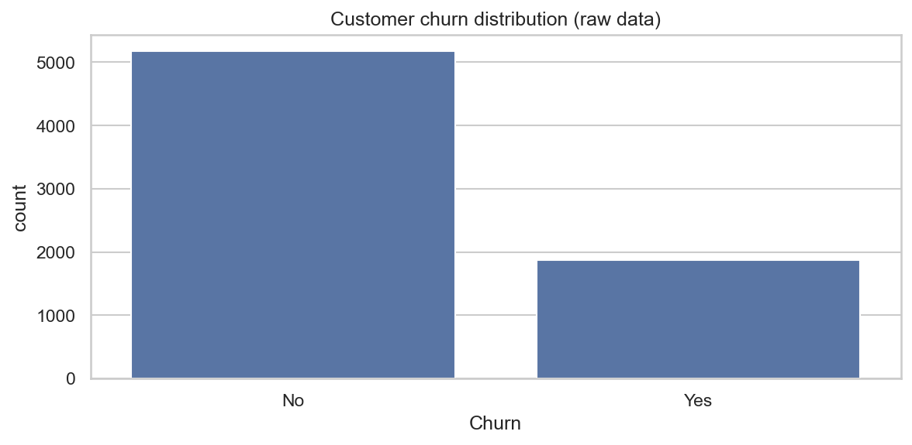  
*Figure 1. Count of Churn (Yes / No) on raw data.*

**Figure 2** shows the same view after cleaning. Counts should be nearly unchanged except for dropped invalid rows, confirming that cleaning did not silently remove large slices of the population.

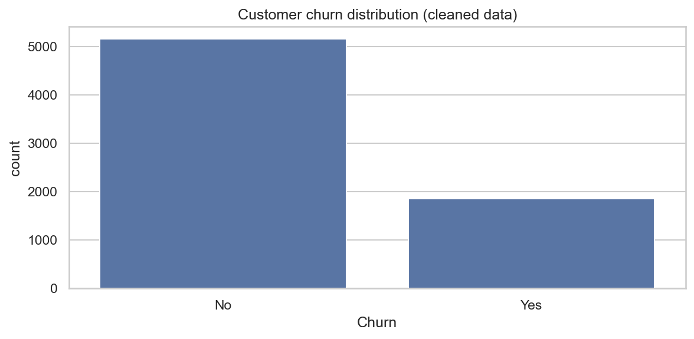  
*Figure 2. Churn distribution after cleaning and deduplication.*

---

## Part III: Exploration before equations

### Intent of exploratory data analysis

Before fitting models, the notebook **reloads** the cleaned CSV. That mirrors a real workflow: analysts trust a known path to curated data rather than chaining every session from raw extracts. Exploration then asks: **where does churn concentrate** in contract type, tenure, charges, and product?

### Findings supported by the charts

**Figure 3 (contract type).** Month-to-month customers show a much higher churn share than customers on one-year or two-year contracts. That aligns with intuition: commitment length is both a product attribute and a behavioral signal. Retention programs often prioritize **early tenure** and **flexible contract** cohorts.

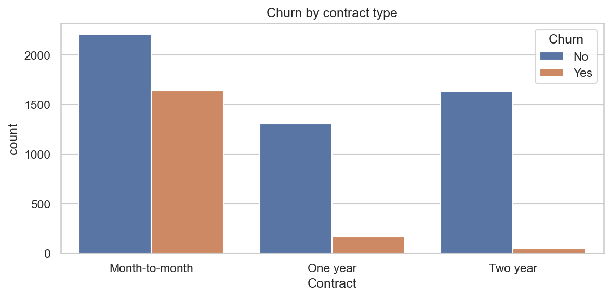  
*Figure 3. Count of customers by contract type, split by churn.*

**Figure 4 (tenure).** Churning customers tend to have **lower median tenure** than those who stay. Short tenure is a strong lifecycle signal: onboarding quality, first-bill shock, and competitive switching all concentrate in the early months.

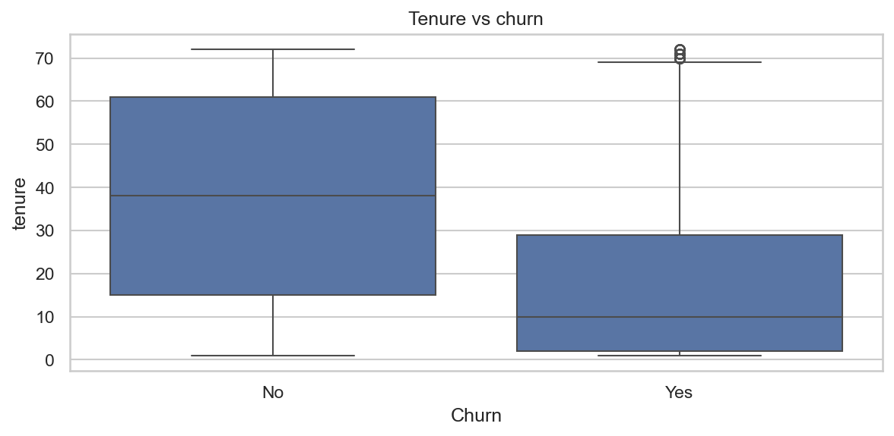  
*Figure 4. Distribution of tenure by churn status.*

**Figure 5 (monthly charges).** Monthly charges differ between churn and non-churn groups. Interpretation requires care: higher charges may reflect **plan mix** (for example premium internet) rather than a direct causal effect of “price alone.”

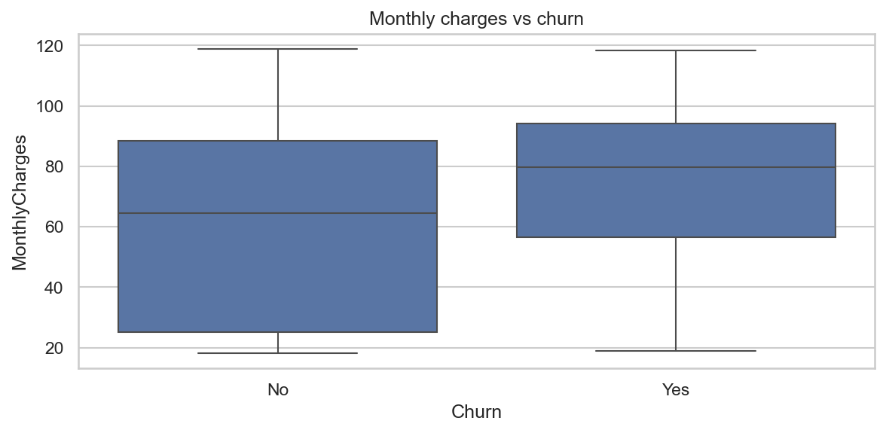  
*Figure 5. Monthly charges by churn status.*

**Figure 6 (internet service).** Internet category relates to churn in the aggregate; fiber often appears alongside higher churn in this dataset, which may bundle price, speed expectations, and competition.

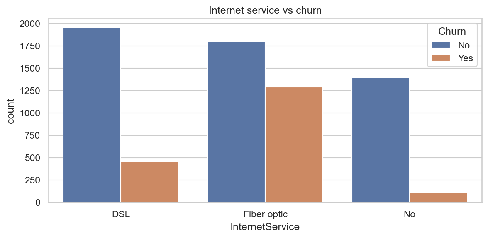  
*Figure 6. Internet service category by churn.*

The notebook also summarizes **payment method** as a frequency table (not reproduced as a figure here). That table supports narratives about billing friction (for example electronic check vs automatic methods) and can be revisited when designing interventions.

### Takeaway from Part III

Exploration does not prove **why** customers leave; it shows **where** risk clusters in historical data. Those clusters guide feature design and give stakeholders intuitive pictures before any model equation appears.

---

## Part IV: Engineering features with intent

### Why add features beyond the raw sheet

Tree models can approximate non-linearities; linear models cannot. **Domain-motivated** features improve signal and interpretability for both. The project adds:

- **Tenure groups** (bins), so risk can change by lifecycle stage without assuming a single linear slope across all months.  
- **Binary flags** for add-on services (Yes to 1, No to 0), enabling counts and linear effects.  
- **TotalServices**, a compact summary of how many add-ons the customer carries.  
- **AvgMonthlySpend**, derived as total charges divided by tenure (with tenure zero guarded), as a simple “intensity” of billing over the relationship.

Implementation lives in `src/feature_engineering.py` and is mirrored step by step in the notebook for transparency.

### What the engineered plots add

**Figure 7.** After encoding, **TotalServices** differs between churn and stay groups, supporting the idea that **breadth of attachment** to the product mix relates to retention.

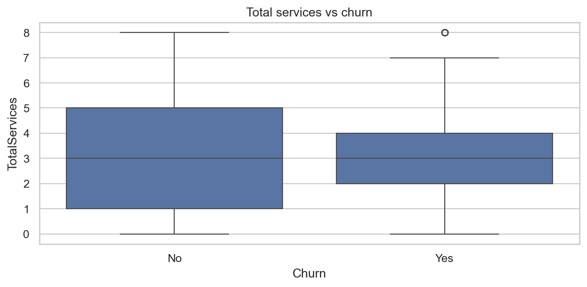  
*Figure 7. Engineered total service count by churn.*

**Figure 8.** **AvgMonthlySpend** contrasts churn vs stay and complements Figure 5 by relating spend to **duration**, not only to a single month’s bill.

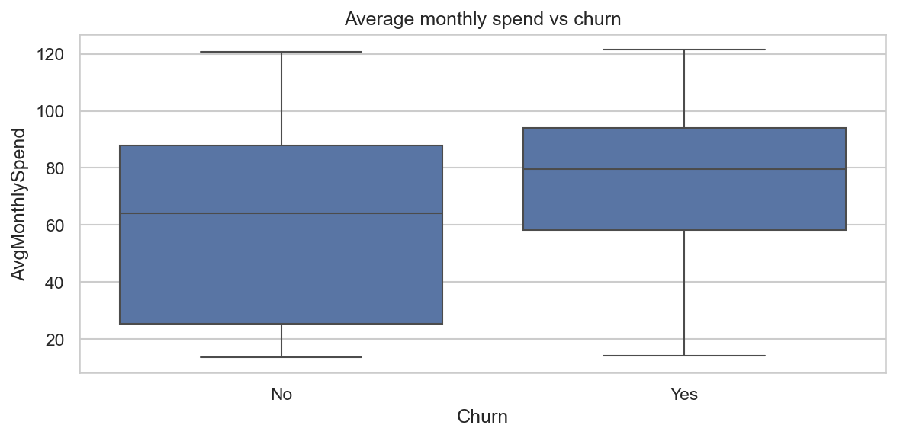  
*Figure 8. Engineered average monthly spend by churn.*

---

## Part V: Modeling design choices

### Target and preprocessing

The target is binary: **0 = stay**, **1 = churn**. Categorical columns are **one-hot encoded**; numeric columns are **standardized** so that large-scale fields do not dominate distance-based or regularized behavior. Unknown categories at scoring time are handled with `handle_unknown="ignore"` on the encoder, which is essential for robust deployment.

The notebook fits a preprocessor once on the **full** feature matrix only to inspect **shape and missing values** after transformation. **All reported model performance** comes from pipelines that **fit the preprocessor on the training split only**, so test rows never influence scaling or category encoding.

### Train and test split

An **80 / 20** split with **stratification** on the target keeps churn prevalence similar in train and test. Without stratification, a random split could by chance yield a test set that is too easy or too hard, which would distort comparison across algorithms.

### Metrics philosophy

The project reports **accuracy**, **precision**, **recall**, **F1**, and **ROC-AUC**. Under moderate class imbalance, accuracy can look flattering while the model misses most churners. **ROC-AUC** summarizes how well the model **ranks** churners above non-churners across thresholds, which matches typical retention use cases (prioritize the top decile of risk). Precision and recall remain important when a concrete **threshold** is chosen for campaigns or agent queues.

---

## Part VI: The baseline model and its ROC curve

### Why logistic regression leads the story

Logistic regression is the **first** fitted classifier because it is fast, stable on tabular data, and **interpretable** through coefficients on transformed columns. It shares the same preprocessing pattern as other models via `logistic_regression_pipeline()` in `src/train_model.py`.

### Reading the ROC curve

**Figure 9** plots the ROC curve for the fitted logistic model on the **held-out test set**. Every point on the curve is a tradeoff between true positive rate and false positive rate at a different threshold. The **area under the curve** is the ROC-AUC printed in the notebook. For this pipeline, test ROC-AUC is typically in the **0.84 to 0.85** range with the default split seed, indicating strong ranking quality for this dataset size and feature set.

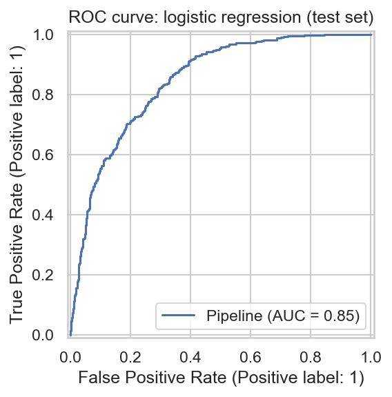  
*Figure 9. Receiver operating characteristic curve for the logistic baseline.*

---

## Part VII: Explainability with SHAP

### Why SHAP appears alongside coefficients

**Coefficients** describe **global parameters** of the linear model: how log-odds change with a one-unit move on each transformed column, holding the linear structure fixed.

**SHAP values** attribute each **prediction** (or a sample of predictions) to features using Shapley-style additive explanations. The **bar plot** highlights features with large **average absolute** impact on the model output for the explained rows. The **beeswarm** plot shows **spread** and how **high vs low feature values** push risk up or down for individual customers.

Because impact depends on both **model weight** and **how often the feature varies** in the data, SHAP rankings need not match raw coefficient magnitude order. Using both views is standard in applied work and in interviews: one speaks to the **equation**, the other to **prediction-level behavior** on real rows.

### Named features in SHAP

Transformed inputs are wrapped in a **pandas DataFrame** whose columns match `get_feature_names_after_preprocessing(...)`, so plots show interpretable names (for example tenure and one-hot contract levels) instead of generic “Feature 1” labels.

**Figure 11** summarizes global importance style effects for a **sample of 100 test rows** (chosen for speed).

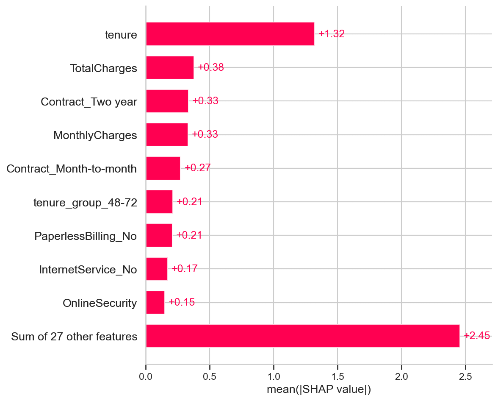  
*Figure 11. Mean absolute SHAP value by feature (sample of 100 test rows).*

**Figure 12** shows the beeswarm view: horizontal position is impact on model output; color encodes feature value from low to high.

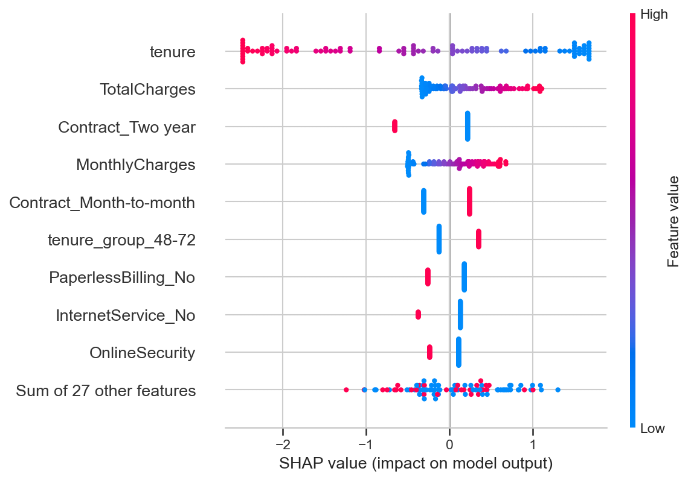  
*Figure 12. SHAP beeswarm (same sample as Figure 11).*

---

## Part VIII: Comparing algorithms and selecting a production baseline

### What was compared

The notebook trains **logistic regression**, **decision tree**, **random forest**, **gradient boosting**, and **XGBoost** on the same training data with a **cloned** preprocessor per model so fits do not overwrite a shared transformer. All models are scored on the **same** test split.

### Interpreting the comparison chart

**Figure 10** ranks models by **test ROC-AUC**. On typical runs with this feature pipeline, **logistic regression** ranks at or near the top while preserving interpretability. Tree ensembles capture non-linearities; here they do not always beat the linear baseline on this split, which is itself a useful finding: **complexity is not guaranteed to win** on a fixed snapshot.

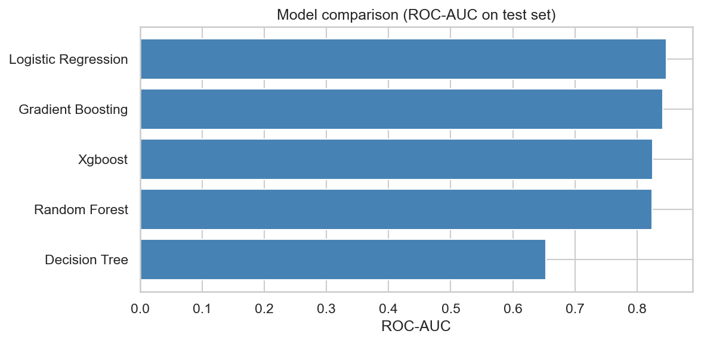  
*Figure 10. Test ROC-AUC by algorithm.*

### Final selection narrative

**Logistic regression** is named the **production baseline** in the notebook because it combines **strong ROC-AUC**, a **practical precision and recall tradeoff** on the churn class (see the classification report), and **coefficients** that support documentation and stakeholder review. Other models remain saved under `models/` for audit and future reassessment; `metrics.json` records the best ROC-AUC model for optional loading through `src.predict.load_pipeline()`.

---

## Part IX: From scores to operations

### Saving pipelines

Each trained estimator is saved as a full **sklearn Pipeline** (preprocessor plus model) with **joblib**. Scoring in production must load that pipeline so transformations match training exactly.

### Probabilities and thresholds

Retention workflows usually consume **probabilities**, not a single yes or no. The notebook demonstrates `predict_proba` on one customer and uses **0.6** only as an **illustrative** high-risk cutoff. Real cutoffs should come from **cost of false positives** (unnecessary outreach or subsidy) versus **false negatives** (missed saves).

### Batch scoring

`src.predict` loads the best saved pipeline and returns churn probabilities for many rows, matching a **batch** or **scheduled** scoring pattern.

---

## Part X: Business insights (associative, not causal)

The following themes recur across EDA, coefficients, and SHAP. They should be communicated as **patterns in past data**, to be validated with experiments and policy review.

1. **Contract and tenure:** Month-to-month plans and shorter tenure associate with higher churn risk. Lifecycle and commitment are central levers.  
2. **Charges and product mix:** Higher monthly charges and certain internet tiers associate with churn; disentangling price from product requires care.  
3. **Add-on depth:** Fewer secured services (support, security products) associates with higher churn in aggregate views.  
4. **Long relationships:** Customers beyond roughly two years of tenure tend to show lower churn in the charts, suggesting that surviving early months is protective.

---

## Part XI: Limitations and honest scope

- The data are a **snapshot**, not a time series; temporal drift and seasonality are not modeled here.  
- Relationships are **associative**; causal claims require randomized or quasi-experimental designs.  
- **Calibration** of probabilities is not tuned; if decisions depend on literal percentages, apply calibration on a validation set.  
- **Fairness** and use of sensitive attributes are governance topics for real customer data; this public dataset is simplified but real systems need policy.  
- **Monitoring** (input drift, score stability, label delay) is required after any deployment.

---

## Part XII: How to reproduce this story

1. `pip install -r requirements.txt`  
2. `python -m src.train_model` to populate `models/`  
3. Run `notebooks/churn_analysis_refactored.ipynb` from top to bottom (project root on `sys.path` as in the first code cell).  

---

## Closing

This project is intentionally structured as a **story**: trust but verify the data, explore before modeling, engineer features with intent, validate honestly on held-out rows, explain with more than one lens, choose a model with both **performance** and **governance** in mind, and leave artifacts that another engineer can load and run. The notebook is the executable line-by-line version of that story; this report is the consolidated narrative for readers who want the arc, the reasoning, and the visuals in one place.
